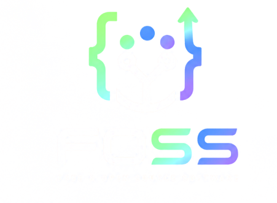

<p align="center">
  
</p>

<h1 align="center">FOSS Club · SRM University Delhi-NCR, Sonepat</h1>

<p align="center">
  <strong>Learn · Build · Contribute · Grow</strong>
</p>

<p align="center">
  The official community website for students who want to explore open source,
  build practical projects, contribute in public, and grow together.
</p>

<p align="center">
  
  
  
  
</p>

## About the website

FOSS Club is a student-led community for builders, contributors, and open-source
enthusiasts at SRM University Delhi-NCR, Sonepat. The website helps students find
a clear starting point and move through four stages:

1. **Learn** — understand Git, GitHub, AI, DevOps, cloud, and open-source fundamentals.
2. **Build** — turn ideas into projects, experiments, and hackathon submissions.
3. **Contribute** — collaborate through issues, pull requests, reviews, and open communities.
4. **Grow** — build visible proof of work and discover mentors, fellowships, internships, and leadership opportunities.

The experience is responsive, accessible, and organized as separate pages so
visitors can explore the club without a long single-page layout.

## Pages

| Route | Purpose |
|:--|:--|
| `/` | Welcome invitation and community call to action |
| `/about` | What FOSS Club is, the problem it solves, and inauguration photo gallery |
| `/events` | Current and upcoming events |
| `/events/four-days-of-ai` | Complete Four Days of AI program, speaker, outcomes, and application link |
| `/community` | Community invitation and official social links |
| `/journey` | Creative wave timeline from the club inauguration to upcoming milestones |
| `/code-of-conduct` | Community standards, reporting guidance, and faculty coordinators |

## Current events

### Four Days of AI · 1st to 4th September 2026

A completely free, beginner-friendly hybrid AI bootcamp and buildathon with
in-person learning, online sessions, an independent build period, and an online finale:

- **Day 1 · Tuesday, 1 September:** In person from 10:00 AM–12:00 PM for Version Control with Git and GitHub, followed by AI Foundations from 1:00–2:00 PM; online Google Meet doubt session from 9:00–11:00 PM
- **Day 2 · Wednesday, 2 September:** Online session on building a first project with an AI agent from 8:00–9:00 PM; buildathon kickoff from 9:30–10:00 PM
- **Day 3 · Thursday, 3 September:** Independent project-building period ending at 9:30 PM
- **Day 4 · Friday, 4 September:** Online closing ceremony and winner announcements at 7:30 PM

The event page also introduces speaker **Bhawna Chauhan**, an MLH Fellow and
founder building NobiRobotics. [Apply for Four Days of AI](https://forms.gle/TW9pS4X9vsPNYjYWA).

### HackAI by SRM · 25–27 September 2026

HackAI by SRM is the next planned AI hackathon. Its detailed program will be
announced later; the website currently keeps this event as a simple **Stay tuned** preview.

## Our journey

The Journey page begins with the FOSS Club inauguration on **13 August 2026**.
It uses photographs from the ceremony and a wave-shaped timeline to connect the
club's beginning with Four Days of AI, HackAI by SRM, and future open-source
workshops, contribution sprints, and student-led project showcases.

## Run locally

### Requirements

- Node.js 20 or newer
- npm

### Setup

```bash
git clone <repository-url>
cd Foss-webpage-
npm ci
npm run dev
```

Open [http://localhost:5173](http://localhost:5173) in your browser.

### Available commands

| Command | Purpose |
|:--|:--|
| `npm run dev` | Start the local Vite development server |
| `npm run build` | Type-check and create a production build in `dist/` |
| `npm run preview` | Preview the production build locally |
| `npm run typecheck` | Run TypeScript checks without creating a build |

## Project structure

```text
src/
├── assets/
│   ├── journey/                 # Inauguration ceremony photographs
│   ├── bhawna-chauhan-speaker.jpg
│   ├── foss-logo-flush.png
│   └── srm-university-sonepat.png
├── components/
│   ├── HeroSection.tsx
│   ├── AboutSection.tsx
│   ├── ProblemSection.tsx
│   ├── InaugurationGallery.tsx
│   ├── EventsSection.tsx
│   ├── FourDaysOfAIPage.tsx
│   ├── CommunitySection.tsx
│   ├── JourneyExperience.tsx
│   ├── CodeOfConductPage.tsx
│   ├── SiteHeader.tsx
│   └── SiteFooter.tsx
├── data/
│   ├── content.ts               # Brand details
│   └── siteContent.ts           # Navigation, links, events, and coordinators
├── styles/
│   └── index.css                # Shared responsive design system
├── App.tsx                      # Route-to-page rendering
└── main.tsx                     # Application entry point
```

## Updating website content

Most recurring content can be updated in one place:

- [`src/data/siteContent.ts`](src/data/siteContent.ts) — navigation, social links, event dates, schedules, outcomes, and faculty coordinators
- [`src/components/FourDaysOfAIPage.tsx`](src/components/FourDaysOfAIPage.tsx) — detailed event presentation and speaker section
- [`src/components/JourneyExperience.tsx`](src/components/JourneyExperience.tsx) — journey milestones and inauguration story
- [`src/components/InaugurationGallery.tsx`](src/components/InaugurationGallery.tsx) — About page photo grid
- [`src/components/CodeOfConductPage.tsx`](src/components/CodeOfConductPage.tsx) — community standards and reporting information

Keep event dates and links in `siteContent.ts` so the Events and Journey pages
stay synchronized.

## Deployment

The project is configured for Vercel as a Vite single-page application:

- Build command: `npm run build`
- Output directory: `dist`
- Client-side route fallback: all routes rewrite to `index.html`

The fallback is defined in [`vercel.json`](vercel.json), so direct visits to
pages such as `/journey` and `/events/four-days-of-ai` work after deployment.

## Community

- [Join the WhatsApp community](https://chat.whatsapp.com/JBZ3Vw2w34DEmwyL9NU6qT)
- [Follow FOSS Club on Instagram](https://www.instagram.com/foss.srmuh?igsi=bHVlbmxxOHl6eGF4)
- [SRM University Delhi-NCR on LinkedIn](https://in.linkedin.com/school/srm-university-haryana/)

## Faculty coordinators

- Dr. Mani Devi
- Dr. Priyanka Maan

---

Built for the FOSS Club community at **SRM University Delhi-NCR, Sonepat**.
