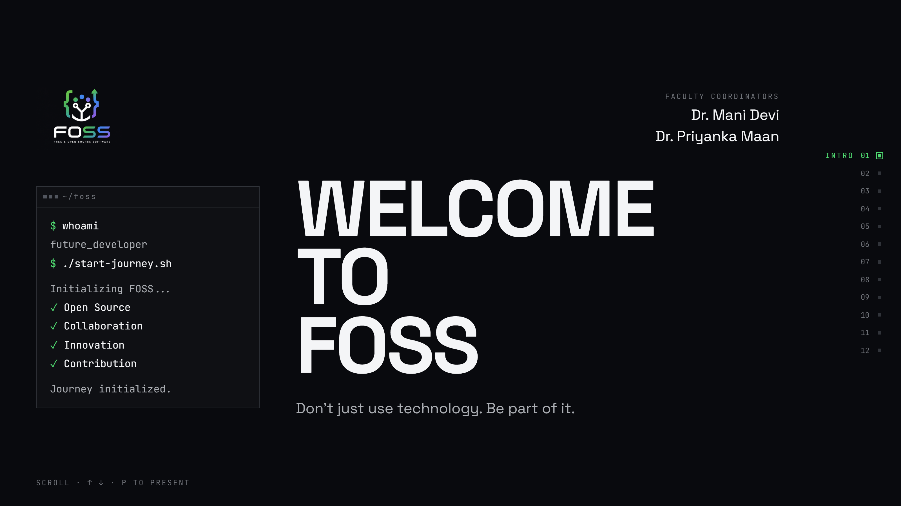

<p align="center">
  
</p>

<h1 align="center">FOSS Interactive Journey</h1>

<p align="center">
  <strong>Don't just consume technology. Shape it.</strong>
</p>

<p align="center">
  A scroll-driven, presentation-style web experience that introduces students to<br>
  Free and Open Source Software — and to the mindset behind it.
</p>

<p align="center">
  
  
  
  
  
</p>

<br>

---

<br>

## Two experiences, one app

| Route | What it is |
|:--|:--|
| `/` `·` `/about` `·` `/events` `·` `/community` | The club website — pages, events, community |
| **`/journey`** | The twelve-scene interactive presentation *(pictured above)* |

They share a stylesheet but never collide. The journey's dark design system is
scoped to `html[data-journey]`, a flag set in
[`main.tsx`](src/main.tsx) before React renders, so the club site's paper
palette, grain overlay and smooth scrolling never reach it — and its Tailwind
tokens only generate utility classes the club site doesn't use.

<br>

---

<br>

## The journey

Not a website about FOSS. A guided journey through it.

Twelve scenes carry the audience from *curious* to *contributor*, each one pinned
to the viewport while its own timeline is scrubbed by your scroll position. The
presenter drives it like a deck — arrow keys, spacebar, a progress rail — while
it still behaves like a website for anyone exploring it alone.

Built against three documents in [`docs/`](docs/):

<br>

| Document | Role |
|:--|:--|
| [`FOSS.prd`](docs/FOSS.prd) | The product contract — what the experience must say and do |
| [`rules.prd`](docs/rules.prd) | Hard design constraints — what it must never look like |
| [`apple_design.md`](docs/apple_design.md) | Principles only. None of its tokens are used; this experience is dark, green-accented and photography-free |

<br>

---

<br>

## The twelve scenes

<br>

| # | Scene | The turn it makes |
|:--|:--|:--|
| `01` | **Intro** | A terminal boots the journey and hands the stage to the headline |
| `02` | **What is FOSS** | Five freedoms drawn as one branch you travel along |
| `03` | **Mindset** | One identity replaces another: consumer → open-source creator |
| `04` | **Technology** | A live 3D constellation — an ecosystem, not a grid of cards |
| `05` | **Real world** | A dead-end chain becomes a loop |
| `06` | **Responsibility** | The obligations that come with using open source |
| `07` | **Contribution** | A ladder you climb from *use* to *contribute* |
| `08` | **Club** | Four phases along a single rule |
| `09` | **Learning** | One proportional band: learn, explore, build, contribute |
| `10` | **Outcomes** | What you walk away with, set as a masthead |
| `11` | **Journey** | The climax — type scales from *curious* to **LEAD** |
| `12` | **Welcome** | Don't just consume technology. Shape it. |

<br>

---

<br>

## Running it

```bash
npm install
npm run dev          # http://localhost:5173  (journey: /journey)
npm run build        # production build into dist/
npm run typecheck
```

<br>

Everything is bundled. Fonts are self-hosted and the page makes **no runtime
network requests**, so it runs on a projector with no internet.

<br>

---

<br>

## Presenting

<br>

| Input | Action |
|:--|:--|
| Scroll / trackpad | Move through the journey |
| <kbd>↓</kbd> <kbd>→</kbd> <kbd>Space</kbd> <kbd>PageDown</kbd> | Next scene |
| <kbd>↑</kbd> <kbd>←</kbd> <kbd>PageUp</kbd> | Previous scene |
| <kbd>Home</kbd> / <kbd>End</kbd> | First / last scene |
| <kbd>P</kbd> | Presentation mode — fullscreen, hides presenter hints |
| Progress rail *(right edge)* | Jump straight to any scene |

<br>

> **Tip** — hover the principles in scene 06. A cursor-following optical lens
> magnifies the text you point at.

<br>

---

<br>

## Editing content

**All copy lives in [`src/data/`](src/data/).** No text is written inside
components, so wording can be revised without touching component logic.

<br>

| File | Holds |
|:--|:--|
| [`content.ts`](src/data/content.ts) | Every headline, body line, label and credit |
| [`technologies.ts`](src/data/technologies.ts) | The technology graph — nodes *and* the edges between them |

<br>

### Scenes

To add, remove or reorder scenes, edit
[`src/scenes/registry.ts`](src/scenes/registry.ts).

It is the single source of truth: scroll order, keyboard order, rail order and
the two-digit ordinals are all derived from it, so the navigation can never
drift out of sync with the content.

<br>

### The logo

Two files sit in [`src/assets/`](src/assets/):

<br>

| File | Purpose |
|:--|:--|
| `foss-logo.png` | The asset exactly as supplied. Never modified. |
| `foss-logo-flush.png` | The same artwork with its flat opaque backdrop un-composited away. **This is what renders.** |

<br>

The supplied export carries a solid `rgb(9,13,18)` plate. Against the page's
`rgb(9,10,14)` that plate reads as a faint rectangle around the mark — the
"logo card" `rules.prd` §02 rules out. The flush variant removes only that
backdrop: no colour is remapped, no shape redrawn.

Point `brand.logo` in `content.ts` back at `foss-logo.png` to use the supplied
file verbatim. If you have the logo with a transparent background — or as SVG —
drop it in and use it directly. That is strictly better than either.

<br>

---

<br>

## Architecture

```
src/
├── scenes/       registry.ts + the twelve scenes
├── components/   Scene stage, TerminalSequence, BranchConnectors,
│                 ProgressRail, Magnifier
├── three/        the WebGL layer + its d3-force layout
├── motion/       GSAP registration and shared easings
├── navigation/   keyboard, scene state, presentation mode
├── data/         all copy and the technology graph
└── styles/       design tokens (@theme)
```

<br>

### Pinning is CSS, not ScrollTrigger

Scenes are pinned with `position: sticky`, not ScrollTrigger's `pin`. Sticky
stays on the compositor and injects no pin-spacer wrappers, so layout stays
predictable and scrubbing stays smooth on projector-class hardware. GSAP's only
job is mapping scroll distance onto each scene's timeline.

There is no scroll hijacking, and no CSS scroll-snap — which cannot coexist with
pinning.

<br>

### Motion ownership is strict

GSAP owns the scroll spine and every scrubbed timeline. Framer Motion owns
discrete UI state only. **No element is animated by both.**

<br>

### Reduced motion is resolved in one place

[`Scene.tsx`](src/components/Scene.tsx) handles it centrally, and every scene
declares an explicit end state rather than simply skipping its animation — so
content is never left hidden.

<br>

### 3D renders only where it argues something

One `<Canvas>`, in scene 04, lazy-loaded in its own chunk and frozen
(`frameloop="never"`) when off screen, with an SVG fallback built from the same
force layout when WebGL is unavailable.

Its rotation is driven by scroll and cursor only — nothing moves on its own.

<br>

### The magnifying lens

[`Magnifier.tsx`](src/components/Magnifier.tsx) wraps any block of text to give
it a cursor-following optical lens:

```tsx
<Magnifier>
  <ul>…</ul>
</Magnifier>
```

The magnified copy is a `cloneNode` snapshot with every `data-*` and `id`
stripped, so it stays invisible to the GSAP selectors and to
`BranchConnectors`' `[data-anchor]` query — wrapping existing markup cannot
disturb either. It renders only for a fine pointer, follows via `requestAnimationFrame`
without a single React re-render, and never affects layout.

<br>

---

<br>

## Credits

<br>

**Faculty Coordinators**

Dr. Mani Devi &nbsp;·&nbsp; Dr. Priyanka Maan

<br>

**Student Coordinators**

Vishnu Bhardwaj &nbsp;·&nbsp; Maitreyi

<br>
